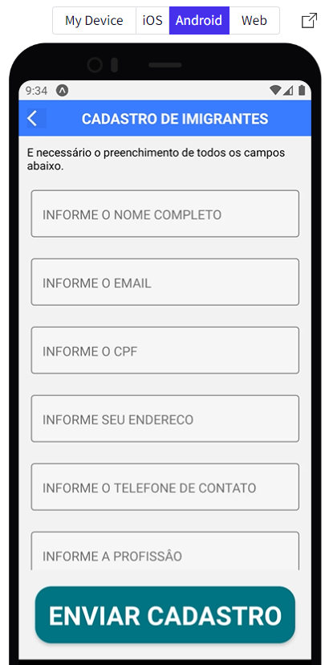
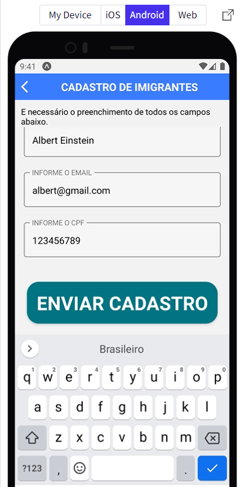
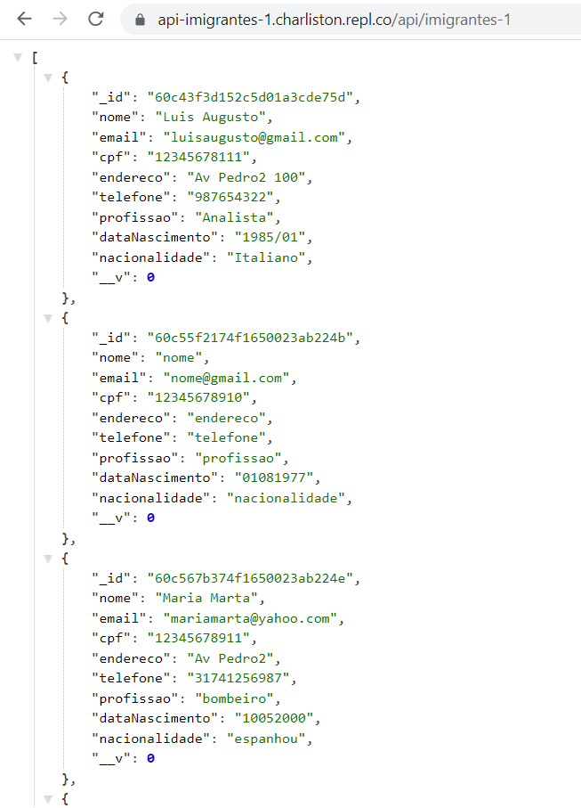

[]

# CadastroImigrantes

## Sobre

Este é um aplicativo de carater totalmente social, construido com a finalidade de ajudar imigrantes que ao chegarem no Brasil possam ter a oportunidade de encontrar um emprego. Para isto basta preencher o formulário do curriculo e enviar, este será direcionado para uma empresa participante deste projeto.  

## Mais informações 

Este aplicativo foi desenvolvido totalmente para aplicação mobile, usando principios de arquitetura rest, e conectividade ao banco de dados mongoDB. O resultado 
com todos os cadastros podem ser vistos em "https://snack.expo.dev/@charlistonrodrigo/sprint3-leo" , selecionando a opção android e Tap to play, ou se preferir visualizar toda a listagem acesse a API "https://api-imigrantes-1.charliston.repl.co/api/imigrantes-1" no seu navegador.

## Layout

  
  
  
  

## Como execultar o projeto

Para executar o projeto basta clonar o link do projeto para o computador na pasta desejada e instalar o expo em seu computador, fazer o import da estrutura do projeto, e abrir o leitor de código de qrCode e ler o qrCode do expo cli para executar o aplicativo no celular.

## Sample Snack app

Open the `App.js` file to start writing some code. You can preview the changes directly on your phone or tablet by scanning the **QR code** or use the iOS or Android emulators. When you're done, click **Save** and share the link!

When you're ready to see everything that Expo provides (or if you want to use your own editor) you can **Download** your project and use it with [expo-cli](https://docs.expo.io/get-started/installation).

All projects created in Snack are publicly available, so you can easily share the link to this project via link, or embed it on a web page with the `<>` button.

If you're having problems, you can tweet to us [@expo](https://twitter.com/expo) or ask in our [forums](https://forums.expo.io/c/snack).

Snack is Open Source. You can find the code on the [GitHub repo](https://github.com/expo/snack).
